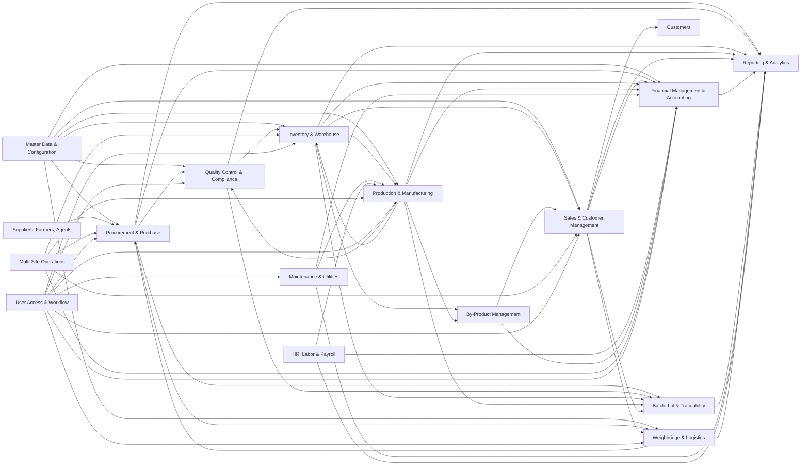
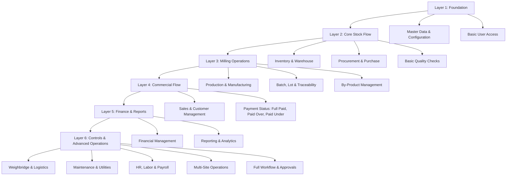

# Rice Mill ERP

This repository documents a modular ERP for a paddy/rice mill. The system follows the full business flow from paddy procurement through milling, inventory control, sales, and accounting, with quality control and reporting connected across every stage.

## Module Relationship Diagram



## Core Business Flow

1. Procurement records paddy purchases from farmers, suppliers, or agents.
2. Weighbridge and Logistics records vehicle movement, transport details, gross weight, tare weight, and dispatch movement.
3. Quality Control verifies moisture, grade, weight, and food-safety parameters before stock acceptance.
4. Inventory stores accepted paddy by lot, godown, variety, and valuation method.
5. Production consumes paddy lots and records soaking, drying, hulling, polishing, grading, and packing.
6. Inventory receives finished rice and by-products such as husk, bran, and broken rice.
7. Sales manages customer orders, pricing, dispatch, invoices, and credit control.
8. HR, Labor & Payroll records operators, shifts, attendance, labor cost, and payroll impact.
9. Finance posts purchase payables, production costs, inventory valuation, receivables, taxes, payroll, and profit/loss.
10. Reporting combines operational and financial data into dashboards, stock statements, yield reports, and MIS views.

## Modules

| Module | Purpose | README |
| --- | --- | --- |
| Procurement & Purchase | Paddy intake, suppliers, purchase orders, weighment, and payable triggers. | [modules/procurement/README.md](modules/procurement/README.md) |
| Inventory & Warehouse | Stock visibility across paddy, rice, by-products, bags, lots, and godowns. | [modules/inventory/README.md](modules/inventory/README.md) |
| Production & Manufacturing | Milling workflow, BOM, input/output capture, yield, wastage, and packing. | [modules/production/README.md](modules/production/README.md) |
| Sales & Customer | Sales orders, invoices, dispatch, pricing, customer credit, and returns. | [modules/sales/README.md](modules/sales/README.md) |
| Financial Management | Payables, receivables, ledger posting, taxes, costing, and profitability. | [modules/finance/README.md](modules/finance/README.md) |
| Quality Control | Inspection plans and quality checks for purchase, process, and finished goods. | [modules/quality-control/README.md](modules/quality-control/README.md) |
| Reporting & Analytics | MIS dashboards, yield analysis, stock reports, receivables, and profitability. | [modules/reporting/README.md](modules/reporting/README.md) |
| Traceability & Batch Control | End-to-end batch and lot tracking from source paddy to final sale. | [modules/traceability/README.md](modules/traceability/README.md) |
| By-Product Management | Husk, bran, broken rice, and other secondary output tracking and sale. | [modules/by-product-management/README.md](modules/by-product-management/README.md) |
| Multi-Site Operations | Multi-godown and multi-mill stock, production, transfers, and controls. | [modules/multi-site-operations/README.md](modules/multi-site-operations/README.md) |
| Master Data & Configuration | Shared setup for items, parties, grades, taxes, units, sites, and business rules. | [modules/master-data/README.md](modules/master-data/README.md) |
| User Access & Workflow | Roles, permissions, approvals, audit logs, and segregation of duties. | [modules/user-access-workflow/README.md](modules/user-access-workflow/README.md) |
| Weighbridge & Logistics | Vehicle movement, weighment, transport, freight, delivery, and gate control. | [modules/weighbridge-logistics/README.md](modules/weighbridge-logistics/README.md) |
| Maintenance & Utilities | Machine maintenance, downtime, spare parts, energy, fuel, and utility cost tracking. | [modules/maintenance-utilities/README.md](modules/maintenance-utilities/README.md) |
| HR, Labor & Payroll | Employees, labor contractors, shifts, attendance, wages, payroll, and labor costing. | [modules/hr-payroll/README.md](modules/hr-payroll/README.md) |

## Development Hierarchy

For a solo developer, build the ERP in layers. Start with the modules that create reusable data and stock movement, then add production, sales, finance, and finally operational support modules.



### Recommended Build Order

| Priority | Build First | Why It Comes Here |
| --- | --- | --- |
| 1 | Master Data & Configuration | All modules depend on items, parties, grades, units, godowns, tax rules, and document settings. |
| 2 | Inventory & Warehouse | Stock ledger and lot-wise inventory are the backbone of a rice mill ERP. |
| 3 | Procurement & Purchase | Creates raw paddy stock and supplier payable data. |
| 4 | Basic Quality Control | Adds moisture, grade, impurity, and acceptance checks before paddy enters stock. |
| 5 | Production & Manufacturing | Converts paddy into finished rice, broken rice, husk, bran, and process loss. |
| 6 | Traceability & By-Product Management | Connects input lots to output lots and captures secondary revenue streams. |
| 7 | Sales & Customer Management | Dispatches finished goods and creates invoices and receivables. |
| 8 | Basic Finance | Handles supplier payables, customer receivables, and payment settlement status. |
| 9 | Reporting & Analytics | Becomes useful after purchase, stock, production, sales, and finance data exist. |
| 10 | Weighbridge, HR, Maintenance, Multi-Site, Full Workflow | Add these after the MVP is stable, unless they are urgent for the mill's daily operation. |

### Solo Developer MVP

The first working version should focus on one complete business loop:

```text
Master Data
  -> Paddy Purchase
  -> Inventory Stock
  -> Production Batch
  -> Finished Rice and By-Product Stock
  -> Sales Invoice
  -> Payment Settlement
  -> Basic Reports
```

## Integration Principles

- Every stock movement must carry lot, godown, item, quantity, and valuation references.
- Every production batch must record input paddy, output rice grades, by-products, process losses, and yield.
- Every purchase and sale must create financial impact through payables, receivables, tax, and ledger postings.
- Quality results should be linked to supplier performance, inventory acceptance, production outcomes, and sales confidence.
- Reporting should read from operational modules instead of duplicating business data.
- Master data should be owned centrally so item, party, grade, tax, and site definitions stay consistent.
- Role-based approvals should protect purchase, stock, production, sales, payment, and adjustment workflows.
- Labor, utility, maintenance, and freight costs should be captured against the right batch, site, or cost center.
