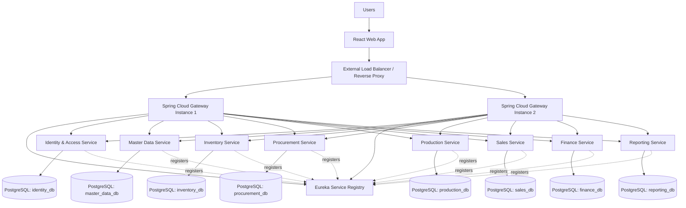
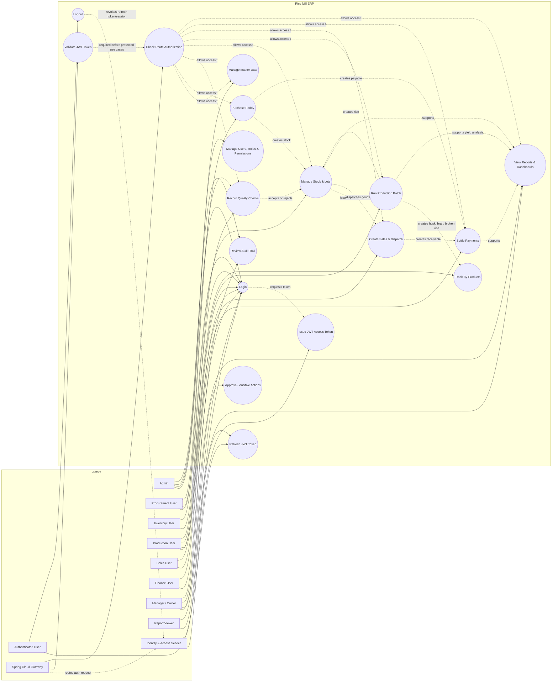
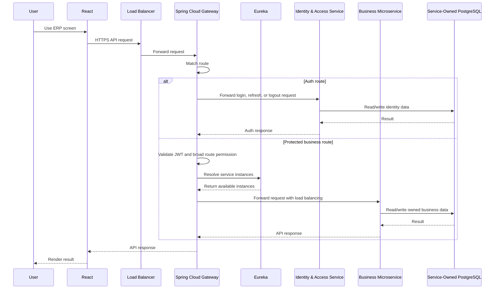
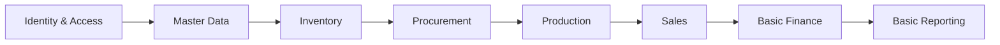
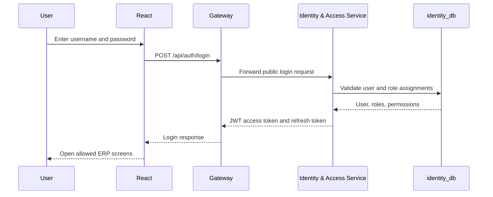
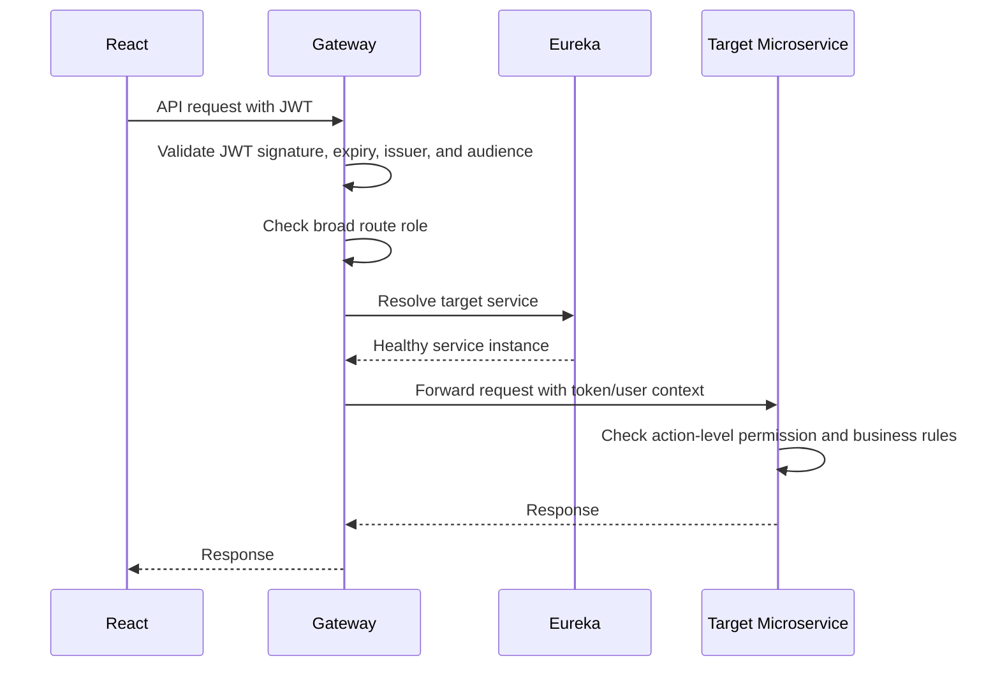
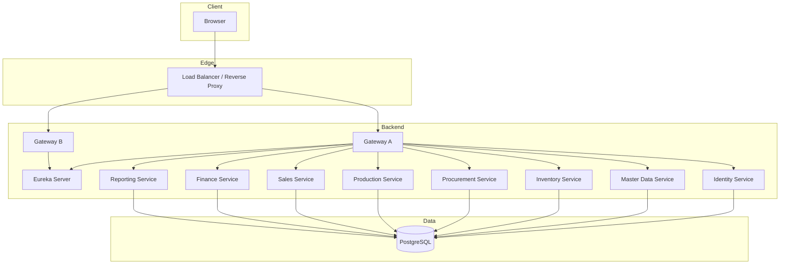

# Rice Mill ERP High-Level Architecture

This document describes the high-level technical architecture for the Rice Mill ERP. The planned stack is:

- Frontend: React
- Backend: Spring Boot microservices
- Service discovery: Netflix Eureka
- Load balancing: Spring Cloud LoadBalancer through Spring Cloud Gateway
- Database: PostgreSQL
- Communication: REST APIs first, domain events later when needed

## Architecture Overview



## ERP Use Case Diagram

This diagram shows the main ERP actors and the high-level use cases they perform through the React app and backend services. It also shows the JWT token use cases handled by the Gateway and Identity & Access Service.



## Main Components

### React Frontend

The React app is the single browser-based user interface for the ERP.

Responsibilities:

- Render module screens for procurement, inventory, production, sales, finance, and reports.
- Store short-lived access tokens in a secure client-side pattern.
- Call backend APIs through the gateway only.
- Avoid direct calls to individual microservices.
- Use roles and permissions to hide unavailable screens and actions, while backend services still enforce security.

### External Load Balancer / Reverse Proxy

The external load balancer sits in front of the backend gateway instances.

Responsibilities:

- Route traffic to healthy Spring Cloud Gateway instances.
- Terminate HTTPS if configured at infrastructure level.
- Provide one stable backend URL for the React frontend.

Possible options:

- Nginx
- HAProxy
- Cloud provider load balancer
- Docker/Kubernetes ingress later

### Spring Cloud Gateway

Spring Cloud Gateway is the backend entry point.

Responsibilities:

- Route API requests to registered services.
- Use Eureka and Spring Cloud LoadBalancer to find healthy service instances.
- Validate JWT access tokens for protected routes.
- Apply broad route-level authorization, such as allowing only finance roles to access `/api/finance/**`.
- Forward authenticated user context to downstream services.
- Apply cross-cutting policies such as CORS, rate limits, request logging, and API version routing.

Example route ownership:

| API Path | Target Service |
| --- | --- |
| `/api/auth/**` | Identity & Access Service |
| `/api/master-data/**` | Master Data Service |
| `/api/inventory/**` | Inventory Service |
| `/api/procurement/**` | Procurement Service |
| `/api/production/**` | Production Service |
| `/api/sales/**` | Sales Service |
| `/api/finance/**` | Finance Service |
| `/api/reports/**` | Reporting Service |

Authentication endpoint examples:

| API Path | Target Service | Token Requirement |
| --- | --- | --- |
| `POST /api/auth/login` | Identity & Access Service | No access token required. |
| `POST /api/auth/refresh` | Identity & Access Service | Valid refresh token required. |
| `POST /api/auth/logout` | Identity & Access Service | Valid access token or refresh token required. |

### Eureka Service Registry

Eureka keeps track of active backend service instances.

Responsibilities:

- Allow each Spring Boot service to register itself.
- Allow the gateway and services to discover each other by service name.
- Support horizontal scaling by registering multiple instances of the same service.

Example service IDs:

- `identity-service`
- `master-data-service`
- `inventory-service`
- `procurement-service`
- `production-service`
- `sales-service`
- `finance-service`
- `reporting-service`

### Identity & Access Service

The Identity & Access Service owns authentication data and permission definitions. It issues tokens, but it should not be called on every request just to check whether a token is valid. The gateway and services can validate signed JWTs locally.

Responsibilities:

- Manage users, roles, permissions, password policy, and login.
- Issue JWT access tokens and refresh tokens.
- Store role and permission assignments.
- Provide user profile and permission lookup APIs.
- Record login, logout, failed login, and sensitive security audit events.

## Microservice Boundaries

For a solo developer, start with fewer, stronger services. Split more later only when the code and data justify it.

| Service | Owns | Related ERP Modules |
| --- | --- | --- |
| Identity & Access Service | Users, roles, permissions, login, JWT, audit basics. | User Access & Workflow |
| Master Data Service | Items, parties, grades, units, godowns, sites, tax setup, document settings. | Master Data & Configuration |
| Inventory Service | Stock ledger, lots, godown stock, receipts, issues, transfers, adjustments. | Inventory, Traceability base |
| Procurement Service | Paddy purchase, supplier/farmer intake, purchase receipt, inbound quality summary. | Procurement, basic QC |
| Production Service | Production batches, paddy consumption, rice output, by-products, yield, loss. | Production, By-Product Management |
| Sales Service | Sales orders, dispatches, invoices, customer receipts summary. | Sales & Customer |
| Finance Service | Payables, receivables, payment settlement, ledger summaries, cost postings. | Finance |
| Reporting Service | Read models, dashboards, MIS reports, aggregated views. | Reporting & Analytics |

Later services:

| Future Service | When To Add |
| --- | --- |
| Quality Service | Add when QC workflows become larger than basic purchase/production checks. |
| Weighbridge & Logistics Service | Add when vehicle gate, weighment, and transport settlement become daily operational needs. |
| HR & Payroll Service | Add when attendance, wages, labor costing, and contractor bills need automation. |
| Maintenance Service | Add when machine downtime, spare parts, and utility cost tracking become important. |
| Multi-Site Service | Add when multiple mills/godowns need separate controls and consolidated reporting. |

## Request Flow

All browser requests enter through the gateway. Login and refresh-token requests are routed to the Identity & Access Service. Protected business requests are authenticated at the gateway, then routed to the target microservice.



## Database Strategy

Use PostgreSQL as the database engine. For microservices, each service should own its own data and should not directly write another service's tables.

Recommended local development approach:

- One PostgreSQL server.
- Separate database per service, or separate schema per service while developing.
- Each service owns its migrations using Flyway or Liquibase.
- Services communicate through APIs, not shared table joins.

Recommended production approach:

- Separate PostgreSQL database per service where practical.
- Independent backup and restore strategy for critical services.
- Read-only reporting replicas or reporting tables for heavy MIS queries.

## Data Ownership Rules

| Data | Owner Service | Other Services Should |
| --- | --- | --- |
| Items, parties, grades, units, godowns | Master Data Service | Read through API or cache controlled references. |
| Stock ledger and lot balance | Inventory Service | Request stock changes through inventory APIs. |
| Paddy purchase records | Procurement Service | Publish accepted paddy receipt to Inventory. |
| Production batches and yield | Production Service | Request paddy issue and finished goods receipt through Inventory. |
| Sales invoice and dispatch | Sales Service | Request stock reservation/dispatch through Inventory and receivable posting through Finance. |
| Payables, receivables, payment status | Finance Service | Receive posting requests from Procurement, Sales, Production, and HR. |
| Dashboards and reports | Reporting Service | Read via APIs, events, or reporting projections. |

## Suggested MVP Service Flow

For the first working version, build the services in this order:



MVP scope:

1. Login and basic role protection.
2. Master data for items, suppliers, customers, paddy varieties, rice grades, godowns, and units.
3. Inventory stock ledger with lot and godown tracking.
4. Paddy purchase receipt that increases raw paddy stock.
5. Production batch that consumes paddy and creates rice plus by-products.
6. Sales invoice that reduces finished stock.
7. Finance settlement status: Full Paid, Paid Over, Paid Under.
8. Reports for stock, purchase, production yield, sales, and outstanding payments.

## Internal Communication

Start with synchronous REST calls because they are simpler for a solo developer.

Examples:

- Procurement calls Inventory to create accepted paddy stock.
- Production calls Inventory to issue paddy and receive finished goods.
- Sales calls Inventory to reserve and dispatch stock.
- Procurement and Sales call Finance to create payable and receivable records.

Later, add asynchronous events for workflows that do not need immediate blocking.

Possible events:

- `PaddyPurchased`
- `StockReceived`
- `ProductionCompleted`
- `SalesInvoiceCreated`
- `PaymentSettled`
- `QualityRejected`

## Security

Security is checked in layers. The gateway is the first security gate, and each microservice is the final business permission gate.

### Authentication and Authorization Responsibilities

| Layer | Responsibility | Example |
| --- | --- | --- |
| React frontend | Hide or show screens and actions based on the logged-in user's roles and permissions. | Hide payment approval button for a sales user. |
| Spring Cloud Gateway | Authenticate requests by validating JWT tokens and apply broad route-level authorization. | Reject unauthenticated requests; allow only finance roles to call `/api/finance/**`. |
| Identity & Access Service | Own users, roles, permissions, login, token issuing, refresh token flow, and security audit. | Verify username/password and issue JWT access token. |
| Microservices | Enforce fine-grained business authorization before executing sensitive actions. | Inventory service checks whether the user can approve stock adjustment. |
| Database | Store only service-owned data; do not rely on database access as the main business permission layer. | Finance service owns payable and receivable tables. |

### Login Flow



### Protected Request Flow



Recommended approach:

- Use Spring Security in the Identity service, gateway, and each protected microservice.
- Use JWT access tokens for API authentication.
- Validate token signature, expiry, issuer, and audience at the gateway.
- Also validate token or trusted user context inside each microservice.
- Keep route-level checks in the gateway and action-level checks inside services.
- Pass user ID, roles, and permissions to downstream services through token claims or trusted internal headers.
- Prefer token claims for roles and stable user identity; use service lookups for permissions that change frequently.
- Enforce critical authorization inside each service, especially for finance, inventory adjustment, payment settlement, production cancellation, and sales discount approval.

Simple rule:

```text
Gateway = authentication + broad route authorization
Microservice = final action-level authorization
```

### Security Examples

| Action | Gateway Check | Service Check |
| --- | --- | --- |
| View stock report | Valid JWT and report/inventory role. | Reporting service checks report permission. |
| Create paddy purchase | Valid JWT and procurement role. | Procurement service checks create purchase permission and allowed site/godown. |
| Adjust stock | Valid JWT and inventory role. | Inventory service checks stock adjustment permission and approval requirement. |
| Approve payment write-off | Valid JWT and finance role. | Finance service checks manager approval permission and write-off limit. |
| Cancel production batch | Valid JWT and production role. | Production service checks batch status, cancellation permission, and stock reversal rules. |

Basic roles:

- `ADMIN`
- `PROCUREMENT_USER`
- `INVENTORY_USER`
- `PRODUCTION_USER`
- `SALES_USER`
- `FINANCE_USER`
- `REPORT_VIEWER`

## Deployment View



## Observability

Add basic observability early so debugging microservices does not become painful.

Minimum setup:

- Structured JSON logs.
- Correlation ID for every request.
- Spring Boot Actuator on every service.
- Health checks used by the gateway and load balancer.
- Central log viewer later, such as ELK, OpenSearch, Grafana Loki, or similar.

Useful health endpoints:

- `/actuator/health`
- `/actuator/info`
- `/actuator/metrics`

## Configuration

Recommended configuration approach:

- Use environment variables for secrets and deployment-specific values.
- Use Spring profiles: `local`, `dev`, `test`, `prod`.
- Consider Spring Cloud Config later if configuration becomes large.
- Never commit real database passwords, JWT secrets, or production credentials.

## Folder Structure Recommendation

```text
rice-mill-erp/
  frontend/
    rice-mill-web/
  backend/
    api-gateway/
    eureka-server/
    identity-service/
    master-data-service/
    inventory-service/
    procurement-service/
    production-service/
    sales-service/
    finance-service/
    reporting-service/
  infrastructure/
    docker-compose.yml
    postgres/
    nginx/
  modules/
    ...
```

## Architecture Principles

- Keep each service responsible for its own data.
- Do not let services directly modify another service's database tables.
- Put cross-cutting routing, CORS, and token checks in the gateway.
- Put business validation inside the owning service.
- Prefer a working modular monolith-style code discipline inside each service before adding too many small services.
- Start with the MVP flow, then split advanced modules when the business process demands it.
