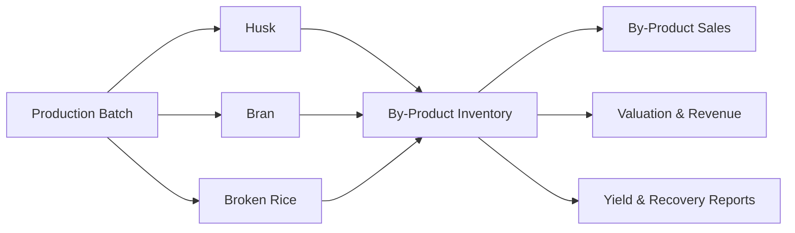

# By-Product Management

The By-Product Management module tracks the secondary outputs of rice milling, including husk, bran, broken rice, and other recoverable materials. These items affect both revenue and yield analysis.

## Responsibilities

- Record by-product output from production batches.
- Maintain by-product stock by lot, godown, grade, and quality status.
- Support sale, internal consumption, disposal, or transfer.
- Value by-product inventory and revenue separately from finished rice.
- Include by-products in yield and recovery analysis.

## Relationships

## Key Data

- By-product item, grade, lot, quantity, and moisture.
- Production batch reference and source paddy lot.
- Stock status, valuation rate, sale rate, and customer.
- Disposal, internal use, transfer, and adjustment records.

## Outputs

- By-product stock ledger.
- By-product sales invoices.
- Revenue and valuation postings for Finance.
- Recovery percentage and profitability reports.

