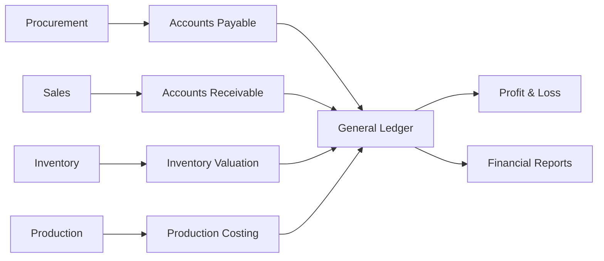

# Financial Management & Accounting

The Finance module converts ERP operations into accounting records. It manages payables, receivables, ledgers, taxes, costing, cash flow, and profitability.

## Responsibilities

- Manage supplier payables from Procurement.
- Manage customer receivables from Sales.
- Maintain chart of accounts, journals, ledgers, cash, and bank records.
- Post inventory valuation, production costing, and cost of goods sold.
- Support tax reporting, deductions, TDS, GST/VAT-style taxes, and statutory reports.

## Relationships

## Key Data

- Chart of accounts, fiscal year, cost center, and voucher types.
- Supplier bills, customer invoices, payments, receipts, and adjustments.
- Tax setup, deductions, freight, brokerage, and other charges.
- Inventory valuation, production cost, revenue, and expense accounts.

## Outputs

- Payables and receivables aging.
- General ledger, trial balance, balance sheet, and profit and loss.
- Tax and deduction reports.
- Batch, product, customer, and supplier profitability.

