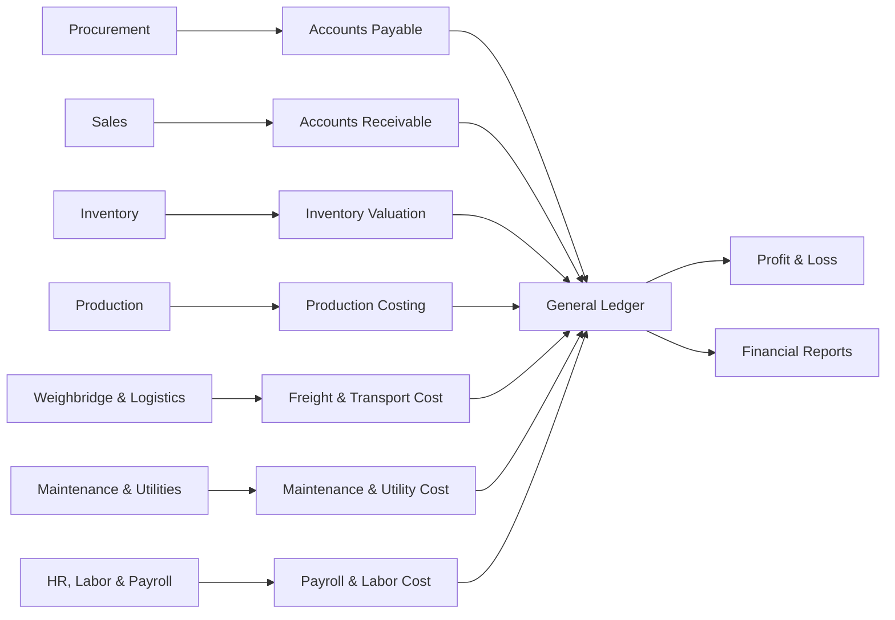

# Financial Management & Accounting

The Finance module converts ERP operations into accounting records. It manages payables, receivables, ledgers, taxes, costing, cash flow, and profitability.

## Responsibilities

- Manage supplier payables from Procurement.
- Manage customer receivables from Sales.
- Track settlement status for full payments, overpayments, and underpayments.
- Maintain chart of accounts, journals, ledgers, cash, and bank records.
- Post inventory valuation, production costing, and cost of goods sold.
- Account for freight, loading, unloading, maintenance, utility, payroll, and spare parts costs.
- Support tax reporting, deductions, TDS, GST/VAT-style taxes, and statutory reports.

## Relationships

## Key Data

- Chart of accounts, fiscal year, cost center, and voucher types.
- Supplier bills, customer invoices, payments, receipts, and adjustments.
- Payment settlement status, paid amount, balance amount, excess amount, and short amount.
- Tax setup, deductions, freight, brokerage, and other charges.
- Inventory valuation, production cost, revenue, and expense accounts.
- Maintenance cost, utility cost, spare parts issue, payroll, labor cost, and transport settlement references.

## Payment Settlement Cases

The Finance module should classify every supplier payment and customer receipt against the original payable or receivable amount.

| Case | Meaning | Accounting Treatment |
| --- | --- | --- |
| Full Paid | Paid amount equals the invoice, bill, or payable amount. | Close the payable or receivable with no remaining balance. |
| Paid Over / Overpayment | Paid amount is greater than the invoice, bill, or payable amount. | Close the original document and keep the excess as advance, credit balance, or refundable amount. |
| Paid Under / Underpayment | Paid amount is less than the invoice, bill, or payable amount. | Keep the remaining balance outstanding or settle it through approved discount, deduction, write-off, or adjustment. |

## Outputs

- Payables and receivables aging.
- General ledger, trial balance, balance sheet, and profit and loss.
- Full paid, overpayment, and underpayment reports.
- Tax and deduction reports.
- Batch, product, customer, and supplier profitability.
