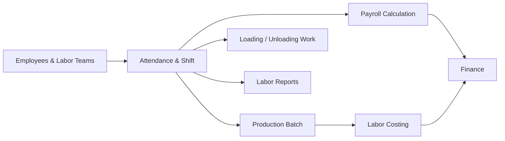

# HR, Labor & Payroll

The HR, Labor & Payroll module manages employees, operators, labor contractors, shifts, attendance, wages, and payroll. It connects labor activity to production batches and financial costing.

## Responsibilities

- Maintain employee, operator, supervisor, contractor, and labor team records.
- Track attendance, shifts, overtime, leave, advances, deductions, and wage rates.
- Assign operators and labor teams to production batches, packing work, loading, and unloading.
- Calculate payroll, contractor bills, overtime, bonus, deductions, and payable wages.
- Feed labor cost into production costing, Finance, and profitability reports.

## Relationships

## Key Data

- Employee, contractor, department, designation, skill, and site.
- Shift, attendance, overtime, leave, advance, deduction, and wage rate.
- Production batch, machine, operator, supervisor, and labor team.
- Payroll period, gross wage, deduction, net payable, and payment status.

## Outputs

- Attendance and shift records.
- Payroll and contractor payable entries.
- Labor cost allocation for Production and Finance.
- Labor productivity, overtime, and wage reports.

