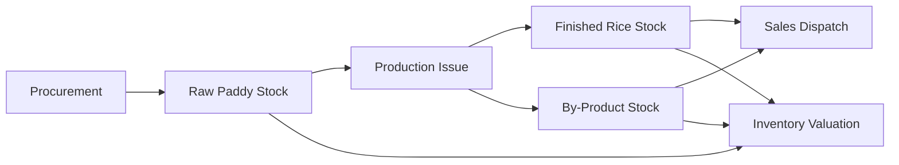

# Inventory & Warehouse Management

The Inventory module controls physical and valued stock across raw paddy, finished rice, by-products, packing material, and consumables. It supports lot-wise and godown-wise visibility.

## Responsibilities

- Track stock by item, lot, godown, grade, packing type, and status.
- Receive paddy from Procurement and finished goods from Production.
- Issue paddy, packaging, and consumables to Production.
- Manage transfers between godowns, mills, and storage locations.
- Maintain valuation for raw material, work in process, finished goods, and by-products.

## Relationships

## Key Data

- Item master, grade, unit of measure, bag size, and packing type.
- Lot, batch, godown, bin, and stock status.
- Receipt, issue, transfer, adjustment, and dispatch records.
- Weighted average, FIFO, or configured costing method.

## Outputs

- Stock ledger and stock statement.
- Lot-wise and godown-wise availability.
- Inventory valuation for Finance.
- Reorder and shortage signals for Procurement and Production.

