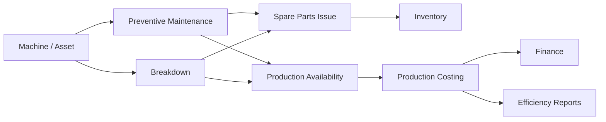

# Maintenance & Utilities

The Maintenance & Utilities module tracks mill equipment, breakdowns, preventive maintenance, spare parts, fuel, electricity, and other utility costs that affect production efficiency and product costing.

## Responsibilities

- Maintain machine, dryer, boiler, generator, elevator, polisher, sorter, and packing equipment records.
- Schedule preventive maintenance and record breakdown maintenance.
- Track downtime, spare parts consumption, technician work, and repair cost.
- Record electricity, fuel, steam, water, and other utility consumption.
- Feed maintenance and utility cost into production costing and profitability analysis.

## Relationships

## Key Data

- Asset, machine, maintenance plan, service interval, and checklist.
- Breakdown time, downtime reason, technician, repair action, and cost.
- Spare parts, consumables, fuel, electricity, steam, water, and meter readings.
- Production batch, shift, machine, and cost center references.

## Outputs

- Maintenance schedule and breakdown history.
- Machine downtime and availability reports.
- Spare parts consumption and reorder signals.
- Utility and maintenance cost allocation for Finance and Production.

