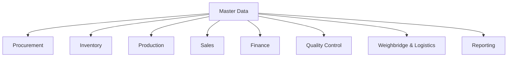

# Master Data & Configuration

The Master Data module provides the shared setup used by every operational and financial module. It keeps item names, grades, parties, units, warehouses, taxes, and business rules consistent across the ERP.

## Responsibilities

- Maintain item masters for paddy, finished rice, by-products, bags, packing materials, spare parts, and consumables.
- Maintain supplier, farmer, agent, customer, transporter, employee, and broker master records.
- Configure rice grades, paddy varieties, units of measure, bag sizes, brands, and product categories.
- Configure godowns, mills, branches, cost centers, tax rules, payment terms, and approval limits.
- Maintain document numbering, fiscal year, voucher types, and workflow defaults.

## Relationships

## Key Data

- Item, party, site, grade, variety, unit, tax, and account mappings.
- Price lists, payment terms, credit limits, transport rates, and bag configurations.
- Approval limits, document series, number formats, and default ledgers.
- Active, inactive, blocked, and audit status for controlled records.

## Outputs

- Consistent reference data for all modules.
- Reduced duplicate setup and naming errors.
- Central configuration for reporting and accounting accuracy.
- Audit trail for changes to sensitive master records.

