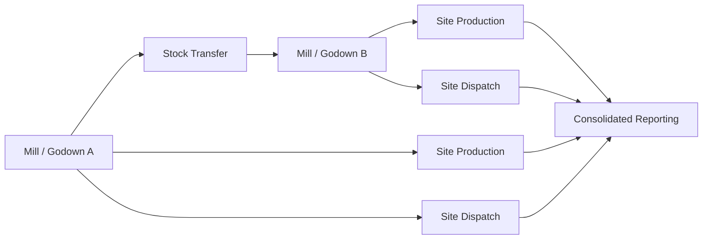

# Multi-Site Operations

The Multi-Site Operations module supports businesses with multiple godowns, mills, yards, or sales locations. It standardizes stock, production, transfers, and reporting across sites.

## Responsibilities

- Maintain mill, godown, storage yard, and branch master data.
- Track stock separately by site while supporting consolidated views.
- Manage inter-godown and inter-mill stock transfers.
- Support site-wise production, sales dispatch, and financial controls.
- Provide permissions and approval flows by location.

## Relationships

## Key Data

- Site, godown, bin, branch, and responsible user.
- Transfer order, dispatch, receipt, in-transit quantity, and variance.
- Site-wise stock, production, sales, cost center, and ledger mapping.
- Approval rules and access permissions.

## Outputs

- Site-wise and consolidated stock reports.
- Transfer tracking and in-transit stock visibility.
- Site-wise production and profitability.
- Centralized MIS for all mills and godowns.

