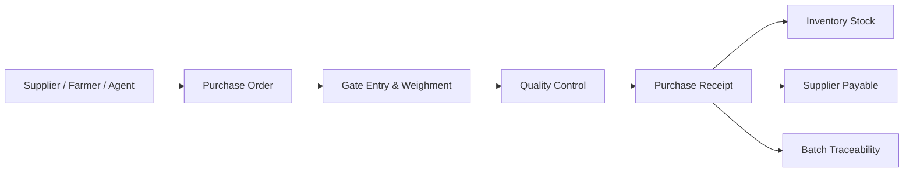

# Procurement & Purchase Management

The Procurement module manages the intake of raw paddy from farmers, suppliers, and agents. It creates the source record for traceability, inventory valuation, supplier settlement, and quality analysis.

## Responsibilities

- Maintain supplier, farmer, agent, and broker profiles.
- Create purchase orders, gate entries, weighment slips, and purchase receipts.
- Capture paddy variety, lot number, moisture, gross weight, tare weight, net weight, and accepted quantity.
- Route received paddy through quality checks before inventory acceptance.
- Trigger payable entries for Finance after purchase confirmation.

## Relationships

## Key Data

- Supplier, farmer, agent, and broker master data.
- Paddy variety, season, crop year, origin, and lot.
- Purchase order, receipt, weighment, and quality references.
- Rate, deductions, taxes, transport cost, and payable amount.

## Outputs

- Accepted paddy stock for Inventory.
- Supplier payable voucher for Finance.
- Batch origin record for Traceability.
- Procurement performance data for Reporting.

