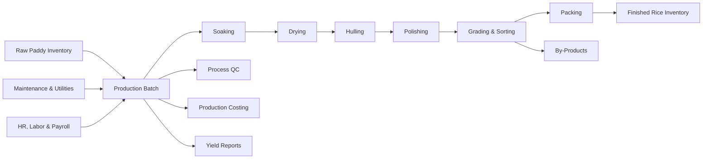

# Production & Manufacturing Management

The Production module manages the rice milling process from paddy issue to finished rice and by-product output. It is the operational center of the ERP.

## Responsibilities

- Plan and execute milling batches.
- Track soaking, drying, hulling, polishing, grading, sorting, and packing.
- Consume paddy lots and packaging materials from Inventory.
- Record output rice grades, broken rice, husk, bran, loss, and wastage.
- Link operator, shift, labor team, and contractor work to each production batch.
- Link machine availability, downtime, utility use, and maintenance cost to production batches.
- Calculate yield, recovery percentage, and out-turn ratio.

## Relationships

## Key Data

- Production batch, process route, machine, operator, labor team, and shift.
- Input paddy lot, quantity, moisture, and quality.
- Output grade, quantity, packing, loss, and by-products.
- Dynamic BOM, conversion cost, labor, utilities, downtime, and overhead allocation.

## Outputs

- Finished rice stock for Inventory and Sales.
- By-product stock for By-Product Management.
- Production cost entries for Finance.
- Yield and loss analysis for Reporting.
