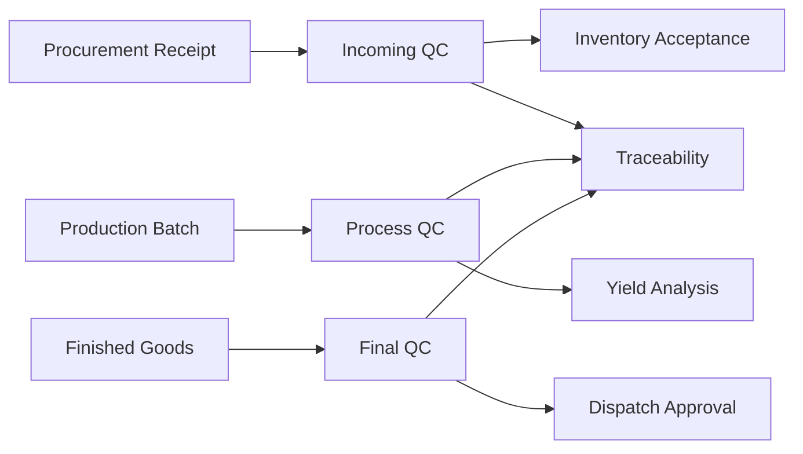

# Quality Control & Compliance

The Quality Control module records inspections at purchase, production, storage, and dispatch stages. It protects product quality and supports regulatory compliance.

## Responsibilities

- Define inspection parameters for paddy, rice, and by-products.
- Record moisture, impurity, broken percentage, grain length, color, smell, infestation, and foreign matter.
- Accept, reject, downgrade, or hold received paddy and finished goods.
- Link QC results to supplier performance and production yield.
- Maintain audit-ready quality and compliance records.

## Relationships

## Key Data

- Inspection plan, parameter, tolerance, result, and status.
- Sample number, lot number, batch number, inspector, and timestamp.
- Accepted, rejected, hold, rework, or downgraded status.
- Compliance notes, certificates, and audit references.

## Outputs

- QC approval or rejection for Inventory.
- Supplier quality scorecards.
- Batch quality history for Traceability.
- Compliance and inspection reports.

