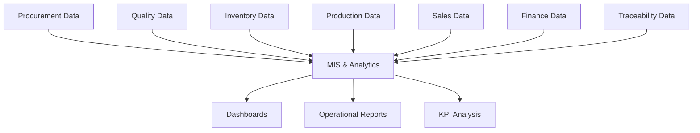

# Reporting & Analytics

The Reporting module provides operational and financial visibility across the ERP. It should read trusted data from other modules and present it as MIS dashboards, statements, and analysis views.

## Responsibilities

- Build dashboards for procurement, stock, production, sales, finance, and quality.
- Provide batch-wise production and yield analysis.
- Monitor outstanding payables, receivables, and cash flow.
- Compare supplier quality, paddy variety performance, and customer profitability.
- Support daily, monthly, seasonal, and fiscal reporting.

## Relationships

## Key Reports

- Paddy purchase register and supplier performance.
- Stock statement by lot, godown, grade, and product.
- Production batch report, yield report, and loss analysis.
- Finished rice and by-product sales reports.
- Payables, receivables, profit and loss, and cash flow.
- Traceability report from paddy source to customer dispatch.

## Outputs

- Management dashboards.
- Scheduled MIS reports.
- Exportable statements for audit and operations.
- Decision support for procurement, production, and sales planning.

