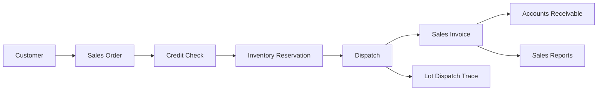

# Sales & Customer Management

The Sales module manages customer orders, dispatch, invoicing, pricing, and credit control for finished rice and by-products.

## Responsibilities

- Maintain customer profiles, delivery locations, preferences, and credit limits.
- Create quotations, sales orders, delivery challans, invoices, and returns.
- Sell rice by grade, brand, packing size, lot, and warehouse availability.
- Support by-product sales for husk, bran, and broken rice.
- Record customer receipt status as full paid, paid over, or paid under.
- Trigger receivable, tax, and revenue entries in Finance.

## Relationships

## Key Data

- Customer, route, sales person, credit limit, and payment terms.
- Rice grade, brand, packing type, rate, discount, tax, and freight.
- Order, dispatch, invoice, return, and receipt references.
- Receipt amount, invoice balance, overpayment credit, and underpayment balance.
- Customer-wise and product-wise sales history.

## Outputs

- Inventory dispatch records.
- Customer invoices and receivables.
- Revenue and tax postings for Finance.
- Customer payment settlement status for Finance.
- Sales trend and outstanding reports.
