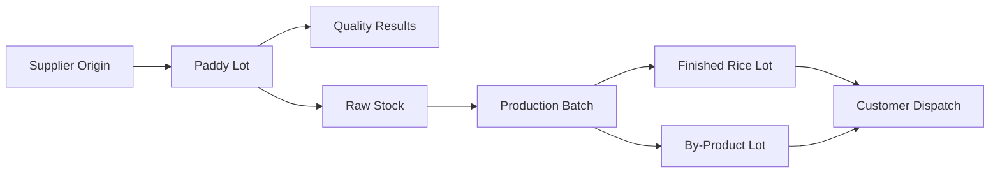

# Traceability & Batch Control

The Traceability module connects supplier origin, quality checks, inventory lots, production batches, finished goods, and customer dispatches. It enables recall support, auditability, and performance analysis.

## Responsibilities

- Assign and maintain lot numbers for purchased paddy.
- Connect paddy lots to production batches.
- Track finished rice and by-products back to input paddy lots.
- Connect dispatched bags or lots to customer invoices.
- Preserve quality and movement history for each batch.

## Relationships

## Key Data

- Lot number, batch number, source, variety, and crop year.
- Quality readings, stock movements, process steps, and output mapping.
- Customer invoice, dispatch, vehicle, and delivery details.
- Recall status and audit references.

## Outputs

- End-to-end batch history.
- Customer dispatch trace report.
- Supplier-to-yield performance analysis.
- Recall and compliance support.

