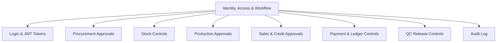

# Identity, Access & Workflow

The Identity, Access & Workflow module controls who can log in and who can view, create, approve, post, modify, or cancel transactions. It protects business controls across procurement, stock, production, sales, and finance.

In the high-level architecture, this business module is implemented by the `identity-service`.

## Responsibilities

- Maintain users, roles, permissions, departments, and site-level access.
- Authenticate users and issue JWT access tokens and refresh tokens.
- Define approval workflows for purchases, stock adjustments, production batches, sales discounts, credit limits, and payments.
- Enforce segregation of duties between transaction entry, approval, and accounting posting.
- Record audit logs for sensitive changes and cancellations.
- Support exception approvals for underpayment settlement, overpayment adjustment, write-offs, and inventory variance.

## Relationships

## Key Data

- User, role, permission, branch, godown, and department.
- Username, password hash, refresh token, JWT claim, and login history.
- Approval level, threshold amount, workflow status, and escalation rule.
- Created by, approved by, posted by, cancelled by, and timestamp history.
- Reason codes for adjustment, rejection, write-off, and override.

## Outputs

- Controlled approvals for high-value or sensitive transactions.
- Audit-ready change history.
- Role-based access by module, location, and document type.
- Reduced risk of unauthorized stock, payment, and ledger changes.

## Low-Level Design

The detailed service design is available here:

- [low-level-design.md](low-level-design.md)
