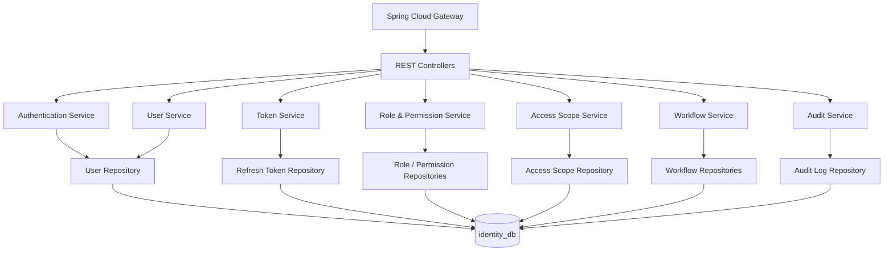
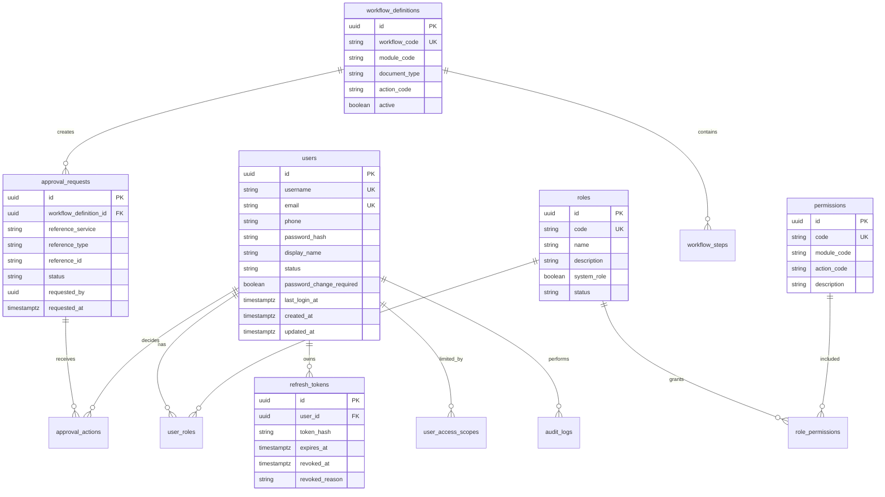
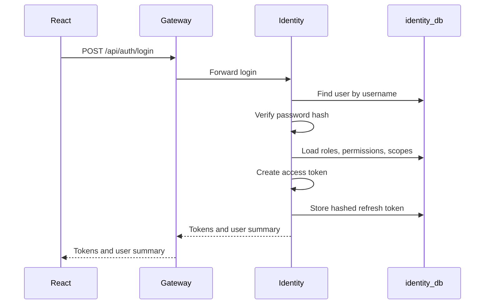
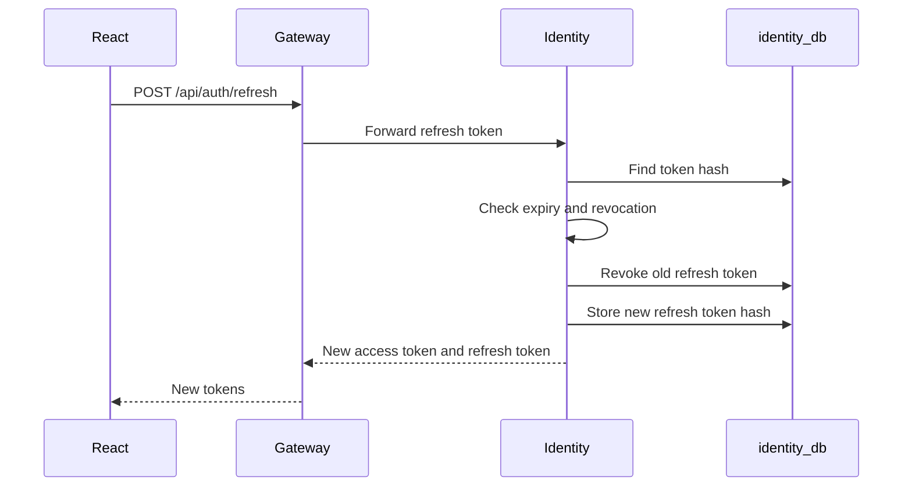
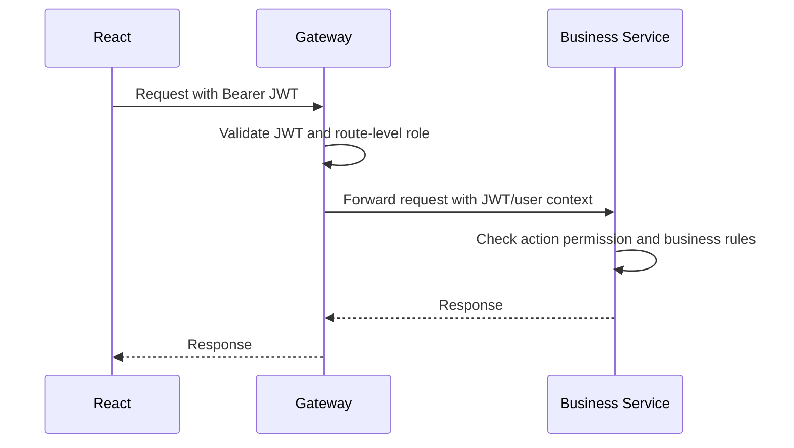
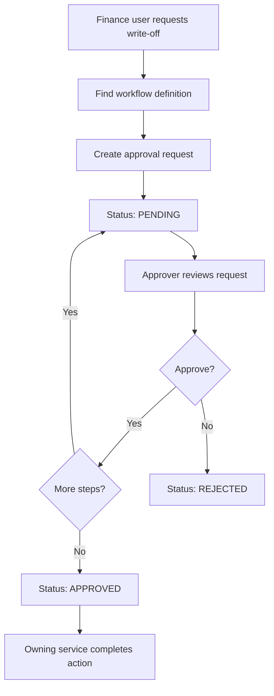

# Identity, Access & Workflow Low-Level Design

This document defines the low-level design for the `identity-service`, which implements the Identity, Access & Workflow module.

## Service Scope

The `identity-service` owns:

- User accounts and employee login identity.
- Password hashing and credential validation.
- JWT access token issuing.
- Refresh token issuing, rotation, revocation, and logout.
- Roles and permissions.
- User access by site, branch, godown, department, and module.
- Approval workflow definitions.
- Approval requests and approval decisions.
- Security and workflow audit logs.

The service does not own business transactions such as purchase, inventory, production, sales, or finance documents. Other services own those records and call this service only for identity, permission, or workflow decisions when needed.

## Service Name

| Item | Value |
| --- | --- |
| Service name | `identity-service` |
| Eureka ID | `identity-service` |
| Base route through Gateway | `/api/auth/**`, `/api/identity/**`, `/api/access/**`, `/api/workflows/**` |
| Database | `identity_db` |
| Suggested schema | `identity` |

## Component Diagram



## Package Structure

```text
identity-service/
  src/main/java/com/ricemill/identity/
    IdentityServiceApplication.java
    config/
      SecurityConfig.java
      JwtProperties.java
      PasswordConfig.java
      OpenApiConfig.java
    auth/
      AuthController.java
      AuthService.java
      TokenService.java
      JwtTokenProvider.java
      RefreshTokenService.java
      dto/
    user/
      UserController.java
      UserService.java
      UserRepository.java
      UserEntity.java
      dto/
    role/
      RoleController.java
      RoleService.java
      PermissionService.java
      RoleRepository.java
      PermissionRepository.java
      entity/
      dto/
    access/
      AccessScopeController.java
      AccessScopeService.java
      AccessScopeRepository.java
      entity/
      dto/
    workflow/
      WorkflowController.java
      WorkflowService.java
      ApprovalService.java
      repository/
      entity/
      dto/
    audit/
      AuditService.java
      AuditRepository.java
      AuditLogEntity.java
    common/
      ApiResponse.java
      ErrorResponse.java
      GlobalExceptionHandler.java
      PageRequestDto.java
      enums/
```

## Core Data Model



## Database Tables

### `users`

| Column | Type | Notes |
| --- | --- | --- |
| `id` | `uuid` | Primary key. |
| `username` | `varchar(80)` | Unique login username. |
| `email` | `varchar(160)` | Unique, nullable if phone login is used. |
| `phone` | `varchar(40)` | Optional. |
| `password_hash` | `varchar(255)` | BCrypt/Argon2 hash, never store plain password. |
| `display_name` | `varchar(160)` | Name shown in UI. |
| `status` | `varchar(30)` | `ACTIVE`, `LOCKED`, `DISABLED`, `PENDING`. |
| `password_change_required` | `boolean` | Force reset after admin-created password. |
| `failed_login_count` | `int` | Used for lockout policy. |
| `last_login_at` | `timestamptz` | Last successful login. |
| `created_at` | `timestamptz` | Audit timestamp. |
| `updated_at` | `timestamptz` | Audit timestamp. |

### `roles`

| Column | Type | Notes |
| --- | --- | --- |
| `id` | `uuid` | Primary key. |
| `code` | `varchar(80)` | Unique role code, example `FINANCE_USER`. |
| `name` | `varchar(120)` | Human-readable name. |
| `description` | `text` | Optional. |
| `system_role` | `boolean` | Prevent accidental deletion of core roles. |
| `status` | `varchar(30)` | `ACTIVE`, `INACTIVE`. |

### `permissions`

Permission codes should follow this format:

```text
MODULE.RESOURCE.ACTION
```

Examples:

- `PROCUREMENT.PADDY_PURCHASE.CREATE`
- `INVENTORY.STOCK_ADJUSTMENT.APPROVE`
- `PRODUCTION.BATCH.CANCEL`
- `FINANCE.PAYMENT_WRITE_OFF.APPROVE`
- `REPORTS.STOCK.VIEW`

| Column | Type | Notes |
| --- | --- | --- |
| `id` | `uuid` | Primary key. |
| `code` | `varchar(160)` | Unique permission code. |
| `module_code` | `varchar(80)` | Example `INVENTORY`. |
| `resource_code` | `varchar(80)` | Example `STOCK_ADJUSTMENT`. |
| `action_code` | `varchar(80)` | Example `APPROVE`. |
| `description` | `text` | Optional. |

### `user_roles`

| Column | Type | Notes |
| --- | --- | --- |
| `user_id` | `uuid` | FK to `users`. |
| `role_id` | `uuid` | FK to `roles`. |
| `assigned_by` | `uuid` | User who assigned the role. |
| `assigned_at` | `timestamptz` | Assignment timestamp. |

### `role_permissions`

| Column | Type | Notes |
| --- | --- | --- |
| `role_id` | `uuid` | FK to `roles`. |
| `permission_id` | `uuid` | FK to `permissions`. |

### `refresh_tokens`

Store only a hash of the refresh token.

| Column | Type | Notes |
| --- | --- | --- |
| `id` | `uuid` | Primary key. |
| `user_id` | `uuid` | FK to `users`. |
| `token_hash` | `varchar(255)` | Hash of refresh token. |
| `expires_at` | `timestamptz` | Expiry timestamp. |
| `revoked_at` | `timestamptz` | Null while active. |
| `revoked_reason` | `varchar(120)` | Example `LOGOUT`, `ROTATED`, `COMPROMISED`. |
| `created_ip` | `varchar(80)` | Optional. |
| `user_agent` | `text` | Optional. |

### `user_access_scopes`

Use this table to restrict users by branch, mill, godown, department, or cost center.

| Column | Type | Notes |
| --- | --- | --- |
| `id` | `uuid` | Primary key. |
| `user_id` | `uuid` | FK to `users`. |
| `scope_type` | `varchar(50)` | `SITE`, `BRANCH`, `GODOWN`, `DEPARTMENT`, `COST_CENTER`. |
| `scope_id` | `varchar(80)` | ID owned by the relevant module/master data service. |
| `scope_name` | `varchar(160)` | Snapshot name for readability. |

### `workflow_definitions`

| Column | Type | Notes |
| --- | --- | --- |
| `id` | `uuid` | Primary key. |
| `workflow_code` | `varchar(120)` | Unique workflow code. |
| `module_code` | `varchar(80)` | Example `FINANCE`. |
| `document_type` | `varchar(80)` | Example `PAYMENT_WRITE_OFF`. |
| `action_code` | `varchar(80)` | Example `APPROVE`. |
| `active` | `boolean` | Whether workflow is active. |

### `workflow_steps`

| Column | Type | Notes |
| --- | --- | --- |
| `id` | `uuid` | Primary key. |
| `workflow_definition_id` | `uuid` | FK to `workflow_definitions`. |
| `step_order` | `int` | Approval order. |
| `required_role_code` | `varchar(80)` | Role that can approve this step. |
| `required_permission_code` | `varchar(160)` | Permission that can approve this step. |
| `min_amount` | `numeric(18,2)` | Optional threshold. |
| `max_amount` | `numeric(18,2)` | Optional threshold. |

### `approval_requests`

| Column | Type | Notes |
| --- | --- | --- |
| `id` | `uuid` | Primary key. |
| `workflow_definition_id` | `uuid` | FK to workflow. |
| `reference_service` | `varchar(80)` | Example `finance-service`. |
| `reference_type` | `varchar(80)` | Example `PAYMENT_WRITE_OFF`. |
| `reference_id` | `varchar(100)` | Business document ID from owning service. |
| `amount` | `numeric(18,2)` | Optional approval amount. |
| `status` | `varchar(30)` | `PENDING`, `APPROVED`, `REJECTED`, `CANCELLED`. |
| `requested_by` | `uuid` | User who requested approval. |
| `requested_at` | `timestamptz` | Request timestamp. |

### `approval_actions`

| Column | Type | Notes |
| --- | --- | --- |
| `id` | `uuid` | Primary key. |
| `approval_request_id` | `uuid` | FK to approval request. |
| `step_order` | `int` | Approved/rejected step. |
| `action` | `varchar(30)` | `APPROVED`, `REJECTED`. |
| `comments` | `text` | Optional. |
| `acted_by` | `uuid` | User who acted. |
| `acted_at` | `timestamptz` | Action timestamp. |

### `audit_logs`

| Column | Type | Notes |
| --- | --- | --- |
| `id` | `uuid` | Primary key. |
| `actor_user_id` | `uuid` | User performing action. |
| `action` | `varchar(120)` | Example `LOGIN_SUCCESS`, `ROLE_ASSIGNED`. |
| `resource_type` | `varchar(100)` | Example `USER`, `ROLE`, `APPROVAL_REQUEST`. |
| `resource_id` | `varchar(100)` | Affected record ID. |
| `ip_address` | `varchar(80)` | Optional. |
| `user_agent` | `text` | Optional. |
| `details_json` | `jsonb` | Before/after or reason details. |
| `created_at` | `timestamptz` | Timestamp. |

## API Design

All APIs are accessed through Spring Cloud Gateway.

### Authentication APIs

| Method | Path | Purpose | Auth |
| --- | --- | --- | --- |
| `POST` | `/api/auth/login` | Validate credentials and issue tokens. | Public |
| `POST` | `/api/auth/refresh` | Rotate refresh token and issue a new access token. | Refresh token |
| `POST` | `/api/auth/logout` | Revoke refresh token/session. | Access or refresh token |
| `GET` | `/api/auth/me` | Return current user profile, roles, permissions, scopes. | Access token |
| `POST` | `/api/auth/change-password` | Change own password. | Access token |

Login request:

```json
{
  "username": "admin",
  "password": "secret"
}
```

Login response:

```json
{
  "accessToken": "jwt-access-token",
  "refreshToken": "opaque-refresh-token",
  "tokenType": "Bearer",
  "expiresInSeconds": 900,
  "user": {
    "id": "uuid",
    "username": "admin",
    "displayName": "System Admin",
    "roles": ["ADMIN"],
    "permissions": ["MASTER.ITEM.CREATE", "REPORTS.STOCK.VIEW"]
  }
}
```

### User APIs

| Method | Path | Purpose | Permission |
| --- | --- | --- | --- |
| `POST` | `/api/identity/users` | Create user. | `IDENTITY.USER.CREATE` |
| `GET` | `/api/identity/users` | Search users. | `IDENTITY.USER.VIEW` |
| `GET` | `/api/identity/users/{id}` | Get user details. | `IDENTITY.USER.VIEW` |
| `PUT` | `/api/identity/users/{id}` | Update user profile/status. | `IDENTITY.USER.UPDATE` |
| `POST` | `/api/identity/users/{id}/reset-password` | Admin password reset. | `IDENTITY.USER.RESET_PASSWORD` |
| `POST` | `/api/identity/users/{id}/roles` | Assign roles. | `IDENTITY.ROLE.ASSIGN` |
| `DELETE` | `/api/identity/users/{id}/roles/{roleId}` | Remove role. | `IDENTITY.ROLE.ASSIGN` |

### Role and Permission APIs

| Method | Path | Purpose | Permission |
| --- | --- | --- | --- |
| `POST` | `/api/identity/roles` | Create role. | `IDENTITY.ROLE.CREATE` |
| `GET` | `/api/identity/roles` | List roles. | `IDENTITY.ROLE.VIEW` |
| `PUT` | `/api/identity/roles/{id}` | Update role. | `IDENTITY.ROLE.UPDATE` |
| `POST` | `/api/identity/roles/{id}/permissions` | Assign permissions to role. | `IDENTITY.PERMISSION.ASSIGN` |
| `GET` | `/api/identity/permissions` | List available permissions. | `IDENTITY.PERMISSION.VIEW` |

### Access Scope APIs

| Method | Path | Purpose | Permission |
| --- | --- | --- | --- |
| `POST` | `/api/access/users/{userId}/scopes` | Add site/godown/department access. | `IDENTITY.ACCESS_SCOPE.UPDATE` |
| `GET` | `/api/access/users/{userId}/scopes` | View user access scopes. | `IDENTITY.ACCESS_SCOPE.VIEW` |
| `DELETE` | `/api/access/users/{userId}/scopes/{scopeId}` | Remove scope. | `IDENTITY.ACCESS_SCOPE.UPDATE` |

### Workflow APIs

| Method | Path | Purpose | Permission |
| --- | --- | --- | --- |
| `POST` | `/api/workflows/definitions` | Create workflow definition. | `WORKFLOW.DEFINITION.CREATE` |
| `GET` | `/api/workflows/definitions` | List workflow definitions. | `WORKFLOW.DEFINITION.VIEW` |
| `POST` | `/api/workflows/approval-requests` | Create approval request. | Service token or user permission |
| `GET` | `/api/workflows/approval-requests/pending` | List pending approvals for current user. | Access token |
| `POST` | `/api/workflows/approval-requests/{id}/approve` | Approve request. | Required workflow permission |
| `POST` | `/api/workflows/approval-requests/{id}/reject` | Reject request. | Required workflow permission |

### Internal Permission APIs

These endpoints are useful when another service needs a decision from `identity-service`.

| Method | Path | Purpose | Caller |
| --- | --- | --- | --- |
| `POST` | `/api/internal/access/check-permission` | Check whether a user has a permission and scope. | Microservices |
| `POST` | `/api/internal/workflows/evaluate` | Find matching workflow for a sensitive action. | Microservices |
| `GET` | `/api/internal/users/{id}/summary` | Resolve user display name/status. | Microservices |

Permission check request:

```json
{
  "userId": "uuid",
  "permission": "INVENTORY.STOCK_ADJUSTMENT.APPROVE",
  "scope": {
    "type": "GODOWN",
    "id": "GODOWN-001"
  }
}
```

Permission check response:

```json
{
  "allowed": true,
  "reason": "Permission and godown scope matched"
}
```

## JWT Design

Use short-lived JWT access tokens and longer-lived refresh tokens.

Recommended values for local MVP:

| Token | Lifetime | Storage |
| --- | --- | --- |
| Access token | 15 minutes | React memory or secure client state. |
| Refresh token | 7 to 30 days | Prefer HttpOnly secure cookie in production; acceptable request body/header for local MVP. |

Suggested JWT claims:

```json
{
  "sub": "user-uuid",
  "username": "admin",
  "displayName": "System Admin",
  "roles": ["ADMIN"],
  "permissions": ["REPORTS.STOCK.VIEW"],
  "scopes": [
    {"type": "GODOWN", "id": "GODOWN-001"}
  ],
  "iss": "rice-mill-identity-service",
  "aud": "rice-mill-erp",
  "iat": 1710000000,
  "exp": 1710000900
}
```

Keep JWT claims reasonably small. If permissions become too large, store only roles in the token and let services call the internal permission-check endpoint for sensitive actions.

## Token Flow

### Login



### Refresh



### Protected Business Request



## Authorization Rules

Use a two-level model:

| Level | Checked By | Purpose |
| --- | --- | --- |
| Route-level authorization | Gateway | Blocks obviously invalid access to service routes. |
| Action-level authorization | Owning microservice | Enforces business permissions and document rules. |

Examples:

| Business Action | Gateway Rule | Service Rule |
| --- | --- | --- |
| Create paddy purchase | User has procurement role. | User has `PROCUREMENT.PADDY_PURCHASE.CREATE` and supplier/site access. |
| Approve stock adjustment | User has inventory role. | User has `INVENTORY.STOCK_ADJUSTMENT.APPROVE`, correct godown scope, and is not the creator. |
| Approve payment write-off | User has finance role. | User has `FINANCE.PAYMENT_WRITE_OFF.APPROVE` and amount is within approval limit. |
| Cancel production batch | User has production role. | User has `PRODUCTION.BATCH.CANCEL` and batch has not already posted irreversible stock movements. |

## Approval Workflow Logic

Workflow is used for sensitive actions that require one or more approvals.

Example workflow: payment write-off approval.



Rules:

- The user who creates a transaction should not approve the same transaction if segregation of duties is required.
- Amount thresholds should be checked against the workflow step.
- Approval request status should be immutable after final approval, rejection, or cancellation.
- The owning service remains responsible for completing the business action after approval.

## Service Classes and Responsibilities

| Class / Component | Responsibility |
| --- | --- |
| `AuthController` | Login, refresh, logout, current user APIs. |
| `AuthService` | Credential validation, login policy, user status checks. |
| `JwtTokenProvider` | Create and validate JWT tokens. |
| `RefreshTokenService` | Store, rotate, validate, and revoke refresh tokens. |
| `UserService` | User CRUD, status changes, password reset. |
| `RoleService` | Role CRUD and role assignment. |
| `PermissionService` | Permission catalog and permission lookup. |
| `AccessScopeService` | Site/godown/department access checks. |
| `WorkflowService` | Workflow definition management. |
| `ApprovalService` | Approval request creation, approval, rejection, pending task lookup. |
| `AuditService` | Security and workflow audit logging. |

## Validation Rules

- Username must be unique.
- Email must be unique when provided.
- Password must be hashed before persistence.
- Disabled or locked users cannot log in.
- Refresh token must be stored as a hash.
- Refresh token rotation should revoke the previous refresh token.
- System roles cannot be deleted.
- Permission codes should be stable and not renamed casually.
- Approval decision must verify role, permission, scope, amount threshold, and document status.

## Default MVP Roles

| Role | Purpose |
| --- | --- |
| `ADMIN` | Full setup and emergency access. |
| `PROCUREMENT_USER` | Paddy purchase and supplier intake. |
| `INVENTORY_USER` | Stock view, receipt, issue, transfer. |
| `PRODUCTION_USER` | Production batch operation. |
| `SALES_USER` | Sales order, dispatch, invoice. |
| `FINANCE_USER` | Payables, receivables, payment settlement. |
| `MANAGER` | Approvals and management reports. |
| `REPORT_VIEWER` | Read-only reports. |

## Default MVP Permissions

Start with a small permission catalog:

```text
IDENTITY.USER.CREATE
IDENTITY.USER.VIEW
IDENTITY.USER.UPDATE
IDENTITY.ROLE.ASSIGN
MASTER.ITEM.VIEW
MASTER.ITEM.CREATE
PROCUREMENT.PADDY_PURCHASE.CREATE
PROCUREMENT.PADDY_PURCHASE.VIEW
INVENTORY.STOCK.VIEW
INVENTORY.STOCK_ADJUSTMENT.CREATE
INVENTORY.STOCK_ADJUSTMENT.APPROVE
PRODUCTION.BATCH.CREATE
PRODUCTION.BATCH.CANCEL
SALES.INVOICE.CREATE
SALES.INVOICE.VIEW
FINANCE.PAYMENT.CREATE
FINANCE.PAYMENT_WRITE_OFF.APPROVE
REPORTS.STOCK.VIEW
REPORTS.FINANCE.VIEW
```

## Error Codes

| Code | Meaning |
| --- | --- |
| `AUTH_INVALID_CREDENTIALS` | Username or password is wrong. |
| `AUTH_USER_LOCKED` | User is locked. |
| `AUTH_USER_DISABLED` | User is disabled. |
| `AUTH_TOKEN_EXPIRED` | Access or refresh token expired. |
| `AUTH_TOKEN_REVOKED` | Refresh token was revoked. |
| `ACCESS_DENIED` | User does not have required permission. |
| `ACCESS_SCOPE_DENIED` | User does not have access to the requested site/godown/department. |
| `WORKFLOW_NOT_FOUND` | No workflow definition matched the requested action. |
| `APPROVAL_NOT_PENDING` | Approval request is not pending. |
| `APPROVAL_LIMIT_EXCEEDED` | Approver does not have enough approval authority. |

## Spring Implementation Notes

- Use Spring Boot 3.x.
- Use Spring Security.
- Use Spring Data JPA for PostgreSQL.
- Use Flyway or Liquibase for migrations.
- Use BCrypt or Argon2 for password hashing.
- Use `jjwt` or `nimbus-jose-jwt` for JWT creation and validation.
- Expose `/actuator/health` for Gateway and load balancer checks.
- Register with Eureka using service ID `identity-service`.

## MVP Build Checklist

1. Create Spring Boot `identity-service`.
2. Add PostgreSQL connection and migration tool.
3. Create `users`, `roles`, `permissions`, `user_roles`, `role_permissions`, `refresh_tokens`, and `audit_logs`.
4. Seed default roles and permissions.
5. Create admin user seed script for local development.
6. Implement login, refresh, logout, and `/me`.
7. Implement JWT validation and token creation.
8. Implement user, role, and permission management APIs.
9. Implement access scope APIs.
10. Add workflow tables and basic approval APIs.
11. Add audit logging for login, logout, role changes, permission changes, and approvals.
12. Register service with Eureka.
13. Add Gateway routes for `/api/auth/**`, `/api/identity/**`, `/api/access/**`, and `/api/workflows/**`.

