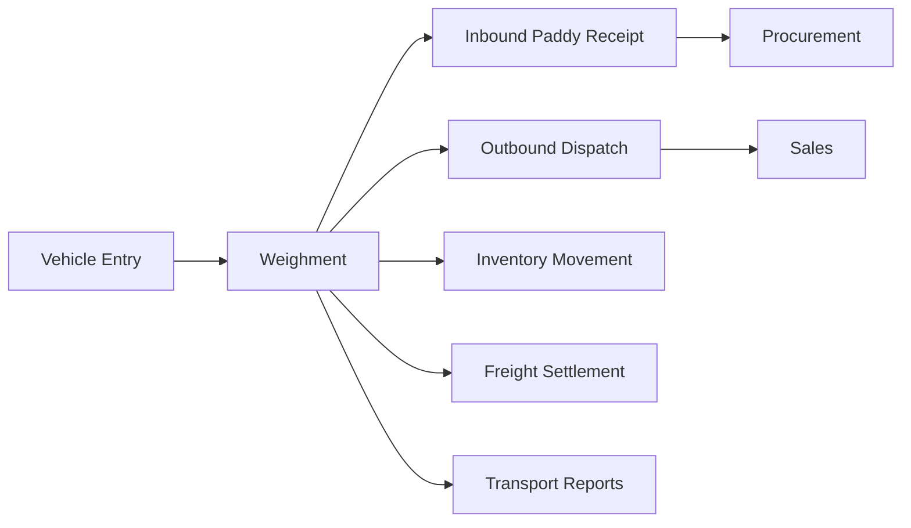

# Weighbridge & Logistics

The Weighbridge & Logistics module manages gate entries, vehicle movement, weighment, freight, transporters, and dispatch tracking. It is important for both paddy procurement and finished goods delivery.

## Responsibilities

- Record vehicle entry, exit, driver, transporter, challan, and route details.
- Capture gross weight, tare weight, net weight, and weighment slips.
- Link inbound weighment to paddy procurement and quality inspection.
- Link outbound weighment to sales dispatch and delivery challans.
- Track freight, loading, unloading, shortage, excess, and transport settlement.

## Relationships

## Key Data

- Vehicle number, driver, transporter, route, gate pass, and challan.
- Gross weight, tare weight, net weight, bridge operator, and timestamp.
- Freight rate, loading charge, unloading charge, shortage, and excess.
- Purchase receipt, sales dispatch, stock transfer, and delivery references.

## Outputs

- Weighment slips for purchase and dispatch.
- Gate register and vehicle movement history.
- Freight payable and transport cost data for Finance.
- Shortage, excess, and transport performance reports.

